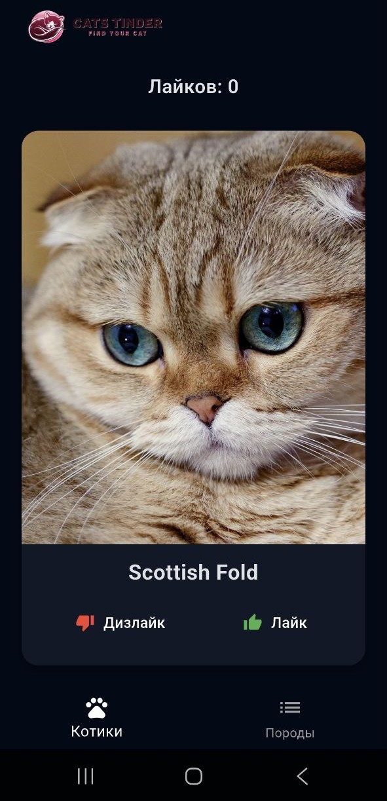
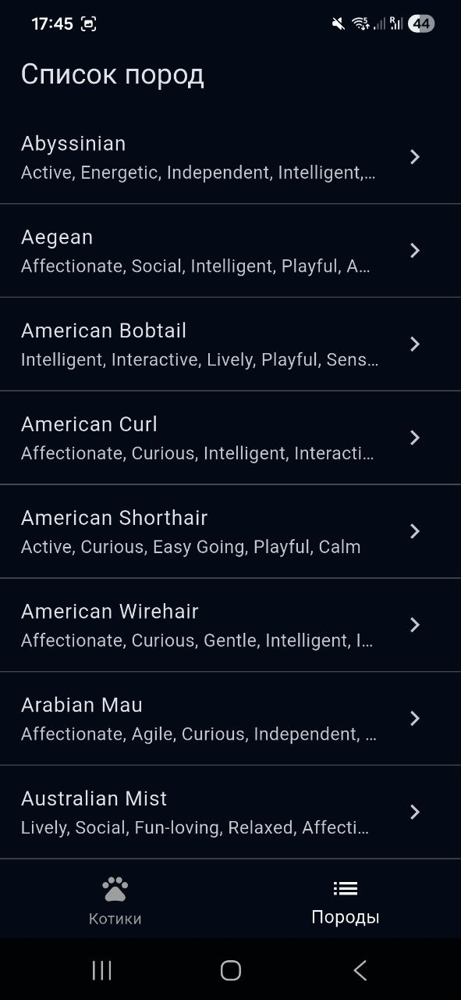
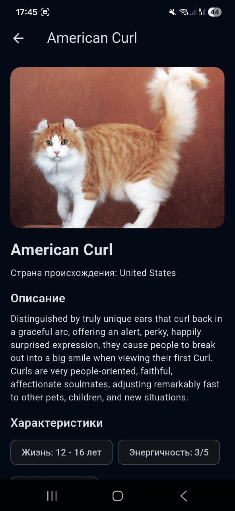

# 🐱 Cat Tinder — приложение на Flutter

**Cat Tinder** — мобильное приложение, в котором можно свайпать котиков, ставить лайки, смотреть описание породы, а также изучать полный список пород с подробными характеристиками.  
Приложение построено на Flutter и использует публичное API **TheCatAPI**.

---

## 🚀 Основной функционал

### ✔ Свайп-карточка котика
- Отображает случайное изображение котика и его породу  
- Поддерживает свайп влево/вправо  
- Свайп вправо = лайк  
- Свайп влево = дизлайк  
- Счётчик лайков обновляется  
- По нажатию на карточку открывается подробное описание

### ✔ Экран детальной информации о котике
- Фото  
- Порода  
- Полное описание  
- Характеристики  
- Красивый нижний bottom sheet

### ✔ Экран списка пород
- Загружается полный список пород  
- Отображается название и темперамент  
- По нажатию открывается экран с подробным описанием  

### ✔ Экран детального описания породы
- Фото породы (если доступно в API)  
- Название  
- Страна происхождения  
- Подробное описание  
- Чипы с характеристиками 

### ✔ Темная тема (тёмно-синий UI)
- Общий dark mode  
- Тёмно-синие фоны  
- Белый текст  
- Карточки и чипы адаптированы под тему  
- В AppBar вместо текста логотип 

---

## 📱 Скриншоты интерфейса

### Главный экран

  

### Список пород

  

### Детальное описание породы

  

---

## 📦 Скачать APK

👉 **[Скачать актуальную версию APK](./app-release.apk)**  

---

## 🛠️ Технологии

- Flutter 3.x  
- Dart  
- HTTP  
- Material 3  
- TheCatAPI  
- Работа с сетевыми ошибками  
- SafeArea, Wrap, Dismissible, BottomSheet  
